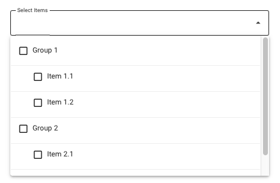

This README includes installation instructions, usage examples, and explanations of the component's props and methods.

# Vuetify MultiSelect

A reusable Vuetify multi-select component that allows for selecting multiple items with support for grouped headers. 


## Features

- Multi-select functionality
- Grouped headers
- Customizable with slots
- Easy integration with Vuetify

## Installation

First, install the library via npm:

```bash
npm install vuetify-multiselect
```
## Usage
Import the component and Vuetify styles in your main entry file (e.g., main.js or main.ts):

```bash
import { createApp } from 'vue';
import App from './App.vue';
import Vuetify from 'vuetify';
import 'vuetify/dist/vuetify.min.css';
import VuetifyMultiSelect from 'vuetify-multiselect';

const app = createApp(App);

app.use(Vuetify);
app.component('VuetifyMultiSelect', VuetifyMultiSelect);

app.mount('#app');

```
Use the component in your Vue component (e.g., App.vue):
```bash
<template>
  <v-app>
    <v-container>
      <vuetify-multi-select
        v-model="selectedItems"
        :items="items"
        label="Select Items"
      />
    </v-container>
  </v-app>
</template>

<script>
export default {
  data() {
    return {
      selectedItems: [],
      items: [
        { header: true, value: 'Group 1' },
        { header: false, value: 'Item 1.1', group: 'Group 1' },
        { header: false, value: 'Item 1.2', group: 'Group 1' },
        { header: true, value: 'Group 2' },
        { header: false, value: 'Item 2.1', group: 'Group 2' },
        { header: false, value: 'Item 2.2', group: 'Group 2' },
      ],
    };
  },
};
</script>
````
## Espected Result:



